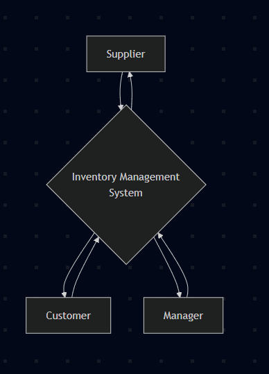
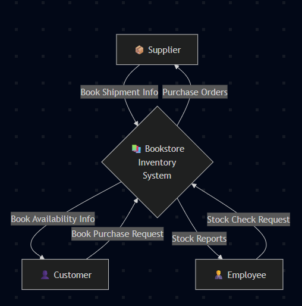
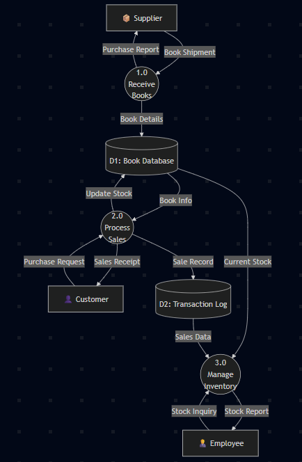
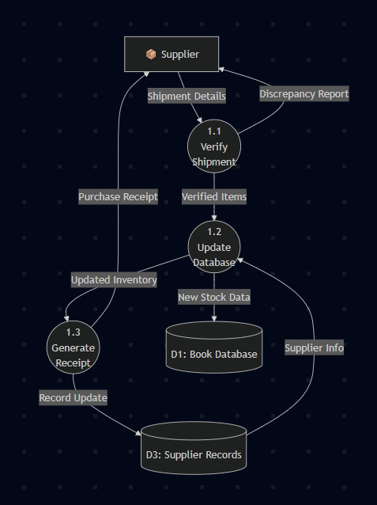
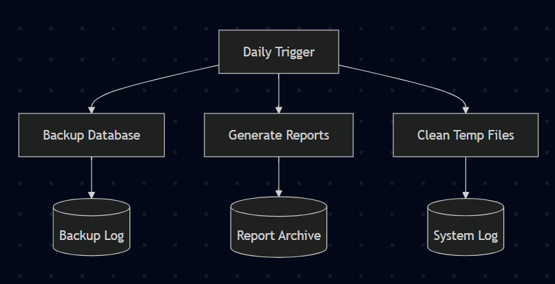
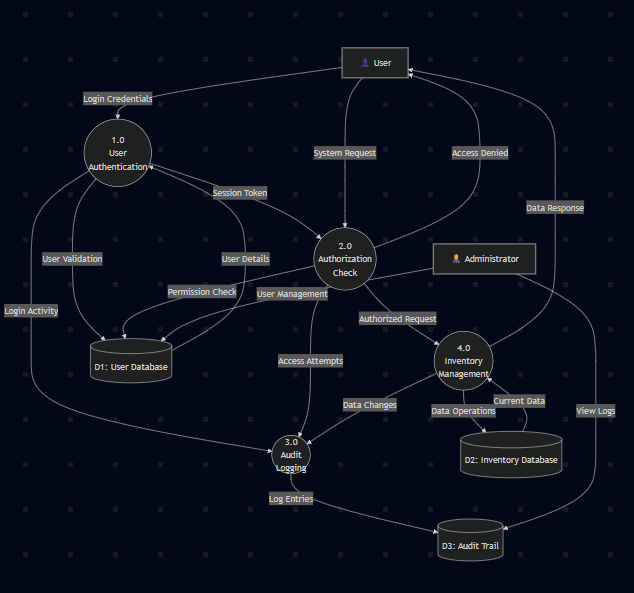
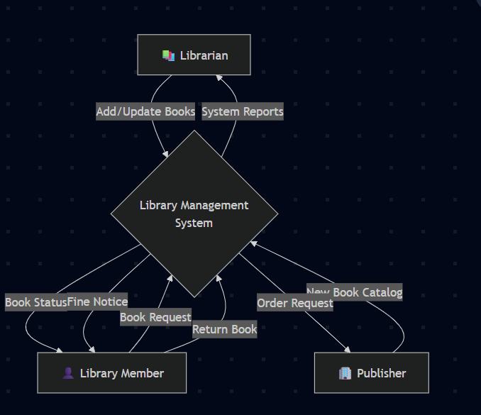

# 📊 Data Flow Diagram (DFD) Explained with Examples

Hey there, system analyst! Ever stared at a complex system and wondered "How the heck does data move through this thing?" or "Where does this information come from and where does it go?" That's exactly where **Data Flow Diagrams (DFD)** come to the rescue!

Think of DFD as creating a roadmap for data—showing how information travels from point A to point B, gets processed, stored, and transformed along the way. It's like drawing a GPS route, but for data instead of cars.

---

## ❓ What is a Data Flow Diagram (DFD)?

A **Data Flow Diagram (DFD)** is a graphical representation that shows how data moves through an information system. It illustrates the flow of data from input to output, through various processes that exist within the system.

In simple terms:

- **Visual representation** of data movement and transformation
- **Shows the logical flow** without getting into technical implementation details
- **Helps understand, analyze, and document** systems effectively
- **Focuses on data transformation** from one form to another

It's like creating a blueprint that shows how your system's "data plumbing" works—where data enters, how it gets processed, where it's stored, and where it exits.

📖 Sources: [GeeksforGeeks DFD](https://www.geeksforgeeks.org/levels-in-data-flow-diagram-dfd/), [Gesaha Nelek Blog](https://gesahanelek.wordpress.com/2018/04/22/contoh-erd-dan-dfd-sistem-informasi-perpustakaan)

---

## 🎯 Goals of Data Flow Diagrams

- 📋 **Document system requirements** → clear understanding of data needs
- 🔍 **Analyze existing systems** → identify inefficiencies and improvements
- 💡 **Design new systems** → plan data flow before implementation
- 🗣️ **Communicate with stakeholders** → visual representation everyone can understand
- 🔧 **Identify system boundaries** → what's inside and outside the system

Example benefits:

- **For developers**: Understand system architecture before coding
- **For business analysts**: Document business processes clearly
- **For project managers**: Communicate system scope to stakeholders

---

## 💡 Benefits of Using DFD

- 🎨 **Visual clarity** → easier to understand than written descriptions
- 📊 **Structured analysis** → systematic approach to system design
- 🔄 **Process identification** → clearly shows what the system does
- 💾 **Data store documentation** → identifies what data needs to be stored
- 🔗 **Interface definition** → shows external entities and their interactions
- 🏗️ **Top-down approach** → start general, then get specific

📖 Extra Reading: [Visual Paradigm DFD Guide](https://www.visual-paradigm.com/guide/data-flow-diagram/), [Lucidchart DFD Tutorial](https://www.lucidchart.com/pages/data-flow-diagram)

---

## 🔧 DFD Basic Symbols and Components

Understanding DFD symbols is like learning the alphabet—master these, and you can read any diagram:

### 1️⃣ External Entity (Terminator)
**Symbol**: Rectangle/Square
**Function**: Represents sources or destinations of data outside the system
**Examples**: Customer, Supplier, Government Agency, Other Systems

```
┌─────────────┐
│  Customer   │  ← External Entity
└─────────────┘
```

### 2️⃣ Process (Transform)
**Symbol**: Circle/Oval (or rounded rectangle)
**Function**: Represents activities that transform data input into data output
**Examples**: Calculate Total, Validate Order, Generate Report

```
    ┌─────────────┐
   ╱  Calculate   ╲  ← Process
  ╱     Total      ╲
 └─────────────────┘
```

### 3️⃣ Data Store (Repository)
**Symbol**: Two parallel lines or open rectangle
**Function**: Represents where data is stored (database, file, memory)
**Examples**: Customer Database, Inventory File, Order Archive

```
 ═══════════════════
 ║  Customer DB    ║  ← Data Store
 ═══════════════════
```

### 4️⃣ Data Flow (Connector)
**Symbol**: Labeled arrow
**Function**: Shows direction and type of data movement
**Examples**: Customer Info, Order Details, Payment Data

```
Customer Info
──────────────→  ← Data Flow
```

---

## 🏗️ DFD Levels Explained

DFDs follow a hierarchical structure, like zooming in on a map:

### 📊 Context Diagram (Level 0)
- **Highest level** view of the system
- **Single process** representing the entire system
- Shows **external entities** and **major data flows**
- **System boundary** is clearly defined

**Example**: Inventory Management System

```mermaid
flowchart TD
    Supplier[Supplier] --> IMS{Inventory Management<br/>System}
    IMS --> Supplier
    Customer[Customer] --> IMS
    IMS --> Customer
    Manager[Manager] --> IMS
    IMS --> Manager
```


### 📈 Level 1 DFD
- **Breaks down** the single process from Level 0
- Shows **major functions** of the system
- **3-7 processes** (following 7±2 rule for readability)
- **Balanced** with Level 0 (same external entities and flows)

### 📉 Level 2+ DFD (Detailed Levels)
- **Further decomposition** of Level 1 processes
- Shows **detailed sub-processes**
- **Technical operations** and specific transformations
- Used when **more detail** is needed for implementation

---

## 📋 Detailed DFD Examples

### 🏪 Level 0: Bookstore Inventory System

```mermaid
flowchart TD
    Supplier[📦 Supplier] 
    Customer[👤 Customer]
    Employee[👨‍💼 Employee]
    
    System{📚 Bookstore<br/>Inventory<br/>System}
    
    Supplier -->|Book Shipment Info| System
    System -->|Purchase Orders| Supplier
    
    Customer -->|Book Purchase Request| System
    System -->|Book Availability Info| Customer
    
    Employee -->|Stock Check Request| System
    System -->|Stock Reports| Employee
```


**Components Explained:**
- **External Entities**: Supplier, Customer, Employee
- **Main Process**: Bookstore Inventory System
- **Data Flows**: Purchase info, availability data, reports

### 📊 Level 1: Bookstore Inventory System Breakdown

```mermaid
flowchart TD
    %% External Entities
    Supplier[📦 Supplier]
    Customer[👤 Customer]
    Employee[👨‍💼 Employee]
    
    %% Processes
    P1((1.0<br/>Receive<br/>Books))
    P2((2.0<br/>Process<br/>Sales))
    P3((3.0<br/>Manage<br/>Inventory))
    
    %% Data Stores
    DS1[(D1: Book Database)]
    DS2[(D2: Transaction Log)]
    
    %% Flows
    Supplier -->|Book Shipment| P1
    P1 -->|Purchase Report| Supplier
    P1 -->|Book Details| DS1
    
    Customer -->|Purchase Request| P2
    P2 -->|Sales Receipt| Customer
    DS1 -->|Book Info| P2
    P2 -->|Sale Record| DS2
    P2 -->|Update Stock| DS1
    
    Employee -->|Stock Inquiry| P3
    P3 -->|Stock Report| Employee
    DS1 -->|Current Stock| P3
    DS2 -->|Sales Data| P3
```


### 🔍 Level 2: "Receive Books" Process Detail

```mermaid
flowchart TD
    %% External Entity
    Supplier[📦 Supplier]
    
    %% Sub-processes
    P11((1.1<br/>Verify<br/>Shipment))
    P12((1.2<br/>Update<br/>Database))
    P13((1.3<br/>Generate<br/>Receipt))
    
    %% Data Stores
    DS1[(D1: Book Database)]
    DS3[(D3: Supplier Records)]
    
    %% Flows
    Supplier -->|Shipment Details| P11
    P11 -->|Verified Items| P12
    P11 -->|Discrepancy Report| Supplier
    
    P12 -->|New Stock Data| DS1
    DS3 -->|Supplier Info| P12
    
    P12 -->|Updated Inventory| P13
    P13 -->|Purchase Receipt| Supplier
    P13 -->|Record Update| DS3
```


---

## ⚡ Advanced DFD Concepts

### 🔀 Modeling Conditional Logic ("If-Then" Scenarios)

When you need to show decision points:

**Method 1: Decision Process with Multiple Outputs**
```mermaid
flowchart TD
    Input[Order Request] --> Check{Check Stock<br/>Availability}
    Check -->|Stock Available| Process[Process Order]
    Check -->|Stock Low| Reorder[Create Reorder]
    Check -->|Out of Stock| Notify[Notify Customer]
```


**Method 2: Conditional Data Flows**
```
Order Request ──→ [Check Stock] ──→ Process Order (if_available)
                             │
                             └──→ Back Order (if_unavailable)
```

### 🔄 Modeling Parallel Processes

When multiple processes run simultaneously:

**Fork/Join Pattern:**
```mermaid
flowchart TD
    Input[Customer Order] --> Split{Split Order}
    Split --> Check1[Check Inventory]
    Split --> Check2[Verify Payment]
    Split --> Check3[Validate Address]
    
    Check1 --> Join{Combine Results}
    Check2 --> Join
    Check3 --> Join
    
    Join --> Process[Process Order]
```


**Independent Parallel Processes:**
```mermaid
flowchart TD
    Trigger[Daily Trigger] --> Backup[Backup Database]
    Trigger --> Report[Generate Reports]
    Trigger --> Cleanup[Clean Temp Files]
    
    Backup --> Log1[(Backup Log)]
    Report --> Log2[(Report Archive)]
    Cleanup --> Log3[(System Log)]
```


---

## 🔒 Security-Enhanced DFD Example

For systems requiring access control and audit trails:

```mermaid
flowchart TD
    %% External Entities
    User[👤 User]
    Admin[👨‍💼 Administrator]
    
    %% Security Processes
    Auth((1.0<br/>User<br/>Authentication))
    Authz((2.0<br/>Authorization<br/>Check))
    Audit((3.0<br/>Audit<br/>Logging))
    
    %% Main Processes
    Inventory((4.0<br/>Inventory<br/>Management))
    
    %% Data Stores
    UserDB[(D1: User Database)]
    InventoryDB[(D2: Inventory Database)]
    AuditLog[(D3: Audit Trail)]
    
    %% Authentication Flow
    User -->|Login Credentials| Auth
    Auth -->|User Validation| UserDB
    UserDB -->|User Details| Auth
    Auth -->|Session Token| Authz
    
    %% Authorization Flow
    User -->|System Request| Authz
    Authz -->|Permission Check| UserDB
    Authz -->|Authorized Request| Inventory
    Authz -->|Access Denied| User
    
    %% Main Process Flow
    Inventory -->|Data Response| User
    Inventory -->|Data Operations| InventoryDB
    InventoryDB -->|Current Data| Inventory
    
    %% Audit Trail
    Auth -->|Login Activity| Audit
    Authz -->|Access Attempts| Audit
    Inventory -->|Data Changes| Audit
    Audit -->|Log Entries| AuditLog
    
    %% Admin Access
    Admin -->|View Logs| AuditLog
    Admin -->|User Management| UserDB
```


---

## 🚨 Common DFD Mistakes to Avoid

### ❌ What NOT to Do:

1. **Direct flows between external entities**
   ```
   Customer ──→ Supplier  ❌ (Missing process)
   ```

2. **Processes without inputs or outputs**
   ```
   [Isolated Process]  ❌ (No data flows)
   ```

3. **Data stores without access**
   ```
   [Unused Database]  ❌ (No read/write flows)
   ```

4. **Too many processes per level**
   ```
   [15 processes on one diagram]  ❌ (Cognitive overload)
   ```

### ✅ Best Practices:

1. **Balance between levels** → same external flows
2. **Use descriptive names** → "Process Order" not "P1"
3. **Follow 7±2 rule** → max 7 processes per diagram
4. **Use verb phrases for processes** → action-oriented naming
5. **Consistent numbering** → hierarchical process IDs
6. **Every data store accessed** → at least one in, one out

---

## 🛠️ Tools for Creating DFD

### Free Tools:
- **Draw.io (now diagrams.net)** → web-based, excellent for beginners
- **Lucidchart Free** → limited but functional
- **Pencil Project** → open-source desktop app

### Professional Tools:
- **Microsoft Visio** → industry standard
- **Lucidchart Pro** → collaborative features
- **Visual Paradigm** → comprehensive modeling suite
- **SmartDraw** → templates and automation

### Code-Based (Mermaid):
```mermaid
flowchart TD
    A[External Entity] --> B((Process))
    B --> C[(Data Store)]
    C --> B
```

---

## 🎯 When to Use DFD

### ✅ Perfect For:
- **System analysis and design** → understanding requirements
- **Business process documentation** → workflow visualization
- **Communication with stakeholders** → non-technical explanations
- **System integration planning** → interface identification
- **Legacy system documentation** → reverse engineering

### ⚠️ Consider Alternatives For:
- **Real-time systems** → use sequence diagrams
- **User interface design** → use wireframes/mockups
- **Object-oriented design** → use UML diagrams
- **Network architecture** → use network diagrams

---

## 📝 Step-by-Step DFD Creation Guide

### 1️⃣ **Identify System Scope**
- What's inside the system?
- What's outside (external entities)?
- What are the main functions?

### 2️⃣ **Create Context Diagram (Level 0)**
- Single process = your entire system
- Add external entities
- Draw major data flows

### 3️⃣ **Decompose to Level 1**
- Break main process into 3-7 sub-processes
- Add data stores
- Ensure balance with Level 0

### 4️⃣ **Add Detail (Level 2+)**
- Further decompose complex processes
- Add technical details
- Maintain consistency

### 5️⃣ **Review and Validate**
- Check for balanced flows
- Verify with stakeholders
- Document assumptions

---

## 🔑 DFD vs Other Diagrams

| Diagram Type | Purpose | Focus | When to Use |
|--------------|---------|-------|-------------|
| **DFD** | Data flow and processing | What the system does | System analysis, documentation |
| **ERD** | Data relationships | How data is structured | Database design |
| **Flowchart** | Process flow and logic | Procedural steps | Algorithm design |
| **UML** | Object-oriented design | Classes and interactions | OOP system design |
| **Network Diagram** | System architecture | Physical/logical connections | Infrastructure planning |

---

## 📊 Complete Example: Library Management System

### Context Diagram:
```mermaid
flowchart TD
    Librarian[📚 Librarian]
    Member[👤 Library Member]
    Publisher[🏢 Publisher]
    
    LMS{Library Management<br/>System}
    
    Member -->|Book Request| LMS
    LMS -->|Book Status| Member
    Member -->|Return Book| LMS
    LMS -->|Fine Notice| Member
    
    Librarian -->|Add/Update Books| LMS
    LMS -->|System Reports| Librarian
    
    Publisher -->|New Book Catalog| LMS
    LMS -->|Order Request| Publisher
```


This example shows a complete system with clear boundaries and data flows that could be further decomposed into detailed levels.

---

## 📝 Final Thoughts

Data Flow Diagrams aren't just academic exercises—they're practical tools that help you:

- **Understand complex systems** before diving into code
- **Communicate clearly** with both technical and non-technical stakeholders  
- **Design better systems** by thinking through data requirements first
- **Document existing systems** for future maintenance

Remember the DFD hierarchy:
1. **Context Diagram** → big picture view
2. **Level 1** → major system functions  
3. **Level 2+** → detailed implementation

Start simple, add detail gradually, and always keep your audience in mind. A good DFD tells a story about how data moves through your system—make it a story worth reading!

---

✅ Want to dive deeper? Check these resources:

- [Visual Paradigm DFD Guide](https://www.visual-paradigm.com/guide/data-flow-diagram/)
- [Lucidchart DFD Tutorial](https://www.lucidchart.com/pages/data-flow-diagram)
- [GeeksforGeeks DFD Levels](https://www.geeksforgeeks.org/levels-in-data-flow-diagram-dfd/)
- [Systems Analysis and Design Textbooks](https://www.google.com/search?q=systems+analysis+design+textbook)

---

🔑 **TL;DR** → DFD = visual roadmap for data flow. Start with context diagram, decompose logically, keep it balanced, and always validate with stakeholders.