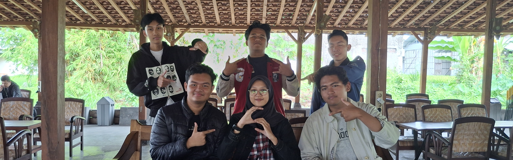
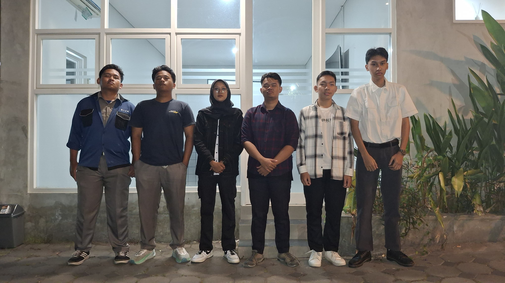
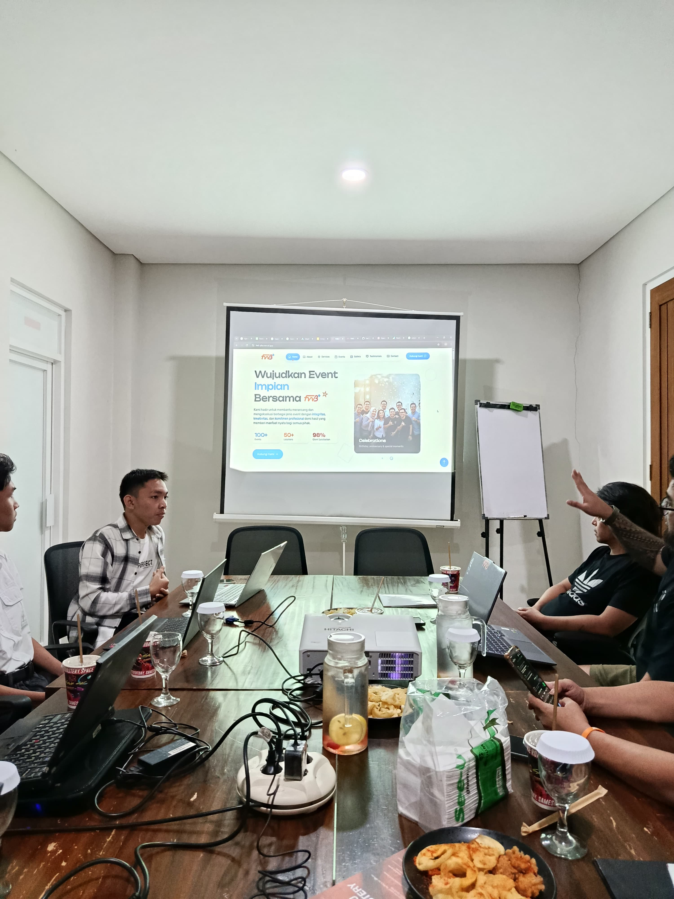
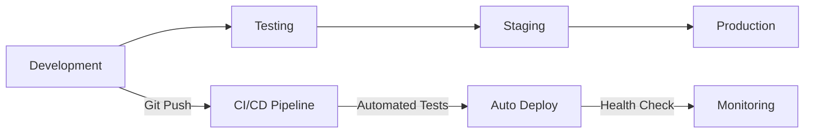
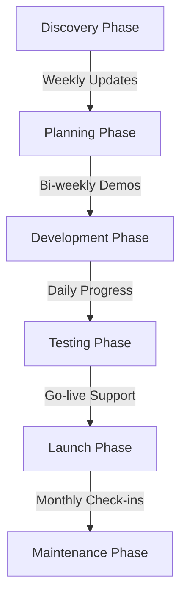
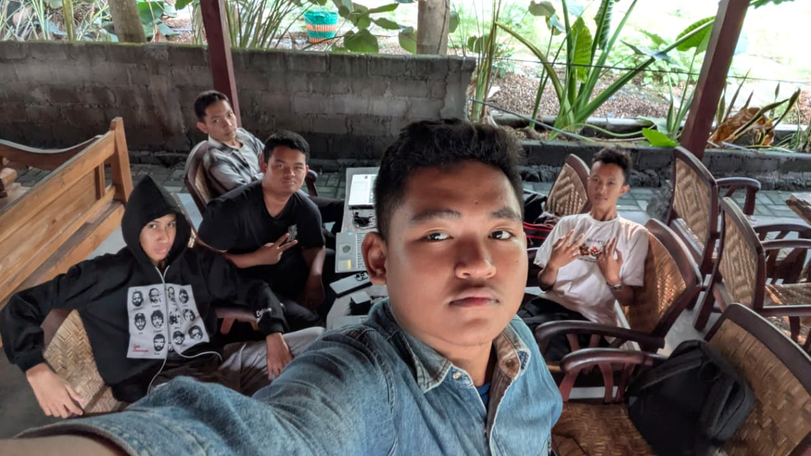
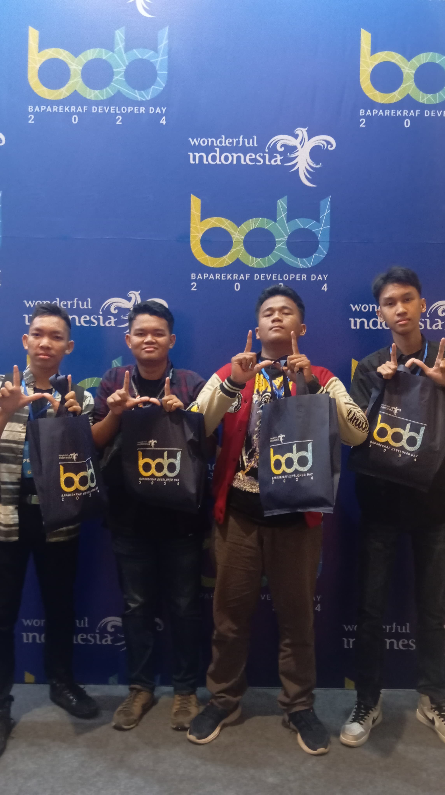

# 🤝 Work Ethics & Culture in Tech Teams: Inside Slaviors Development

Hey fellow developers and tech enthusiasts! Ever wondered what makes a tech team tick? Or how a group of vocational high school students can transform from competition participants into a professional development team? Today, I'm pulling back the curtain on **Slaviors**, our journey, our work culture, and the ethics that drive our daily operations.

Whether you're building your own dev team, joining a startup, or just curious about how modern tech teams operate, this deep dive into our work ethics and culture might just give you some valuable insights.

---

## ❓ What Are Work Ethics & Culture in Tech?

Before diving into Slaviors' story, let's establish what we mean by **work ethics** and **work culture** in the tech world:

### 🎯 Work Ethics in Technology
**Work ethics** refers to the moral principles and values that guide professional behavior and decision-making. In tech, this includes:

- **Code Quality Standards** → writing maintainable, secure, and efficient code
- **Professional Responsibility** → meeting deadlines and delivering on promises  
- **Continuous Learning** → staying updated with evolving technologies
- **Collaborative Spirit** → effective teamwork and knowledge sharing
- **Ethical Development** → considering the social impact of technology

### 🏗️ Work Culture in Development Teams
**Work culture** encompasses the shared beliefs, practices, and environment that shape how a team operates:

- **Communication Patterns** → how team members interact and share information
- **Decision-Making Processes** → hierarchical vs. collaborative approaches
- **Work-Life Integration** → balancing productivity with personal well-being
- **Innovation Mindset** → encouraging experimentation and creative problem-solving
- **Growth Orientation** → supporting individual and collective development

---

## 🎯 Why Work Ethics & Culture Matter in Tech

The tech industry moves fast, and without strong ethical foundations and positive culture, teams can quickly:

- 🔥 **Burn out** from unsustainable work practices
- 🐛 **Produce poor-quality code** due to rushed timelines
- 💔 **Lose team cohesion** from lack of clear values
- 📉 **Deliver subpar client results** without accountability
- 🚪 **Experience high turnover** from toxic environments

Conversely, teams with strong ethics and culture see:

- 🚀 **Higher productivity** through clear expectations
- 💡 **Better innovation** in psychologically safe environments
- 🤝 **Stronger client relationships** built on trust
- 📈 **Sustainable growth** with long-term thinking
- 🏆 **Professional development** for all team members

---

## 👥 Meet Slaviors: From Competitors to Collaborators



Before diving into our work culture, let me introduce **Slaviors**, a team that started in programming competitions and evolved into a professional development collective.

### 🏆 Our Origin Story

**Established**: 2024 - officially formed as a development team  
**Growth Phase**: Mid-2024 - building our first client projects  
**Current Status**: Actively accepting client work and expanding our capabilities

We're 7 passionate technologists who united through shared experiences in coding competitions. What started as a group of individual competitors became a cohesive team dedicated to **transforming ideas into digital reality**.

### 🎯 Our Mission & Values

**Mission**: We empower businesses of all sizes to establish compelling digital presences with powerful, user-friendly platforms tailored to their unique needs.

**Core Values**:
- **Client-Centered Approach** → every solution crafted with specific business challenges in mind
- **Technical Excellence** → leveraging cutting-edge technologies and best practices  
- **Affordable Innovation** → making advanced digital solutions accessible to all businesses

### 🛠️ What We Do

- **Web Development** → custom, responsive, high-performance websites
- **Chatbot Development** → intelligent AI-powered customer engagement solutions  
- **UI/UX Design** → intuitive and visually stunning user experiences

---

## 🏢 Slaviors Organizational Structure

We've structured ourselves like a startup-ready organization with clear roles and responsibilities:

### 👨‍💼 Leadership Team

#### 🧠 **Rafi Ahmad Zaini** - CEO (Chief Executive Officer)
- **Focus**: Cybersecurity, Penetration Testing, AI/ML Engineering
- **Role**: Strategic direction, team leadership, client relationships
- **Philosophy**: "Combining AI innovation with robust cybersecurity strategies"

#### 💰 **Muhammad Qurtifa Wijaya** - CFO (Chief Financial Officer)  
- **Focus**: Frontend Development, Finance Management, Administration
- **Role**: Financial planning, resource allocation, administrative oversight
- **Philosophy**: "Creating engaging experiences while maintaining fiscal responsibility"

#### 🎨 **Muhammad Farrel Rabbani** - CCO (Chief Creative Officer)
- **Focus**: Graphic Design, UI/UX, Media Administration, Frontend Development
- **Role**: Brand identity, creative direction, user experience design
- **Philosophy**: "Crafting intuitive, visually stunning interfaces that elevate brands"

#### 🛠️ **Rejaka Abimanyu Susanto** - CTO (Chief Technology Officer)
- **Focus**: Full-stack Development, Database Engineering, Server Management
- **Role**: Technical architecture, development environment, system planning
- **Philosophy**: "Transforming ideas into scalable, efficient systems"

#### 🔧 **Muhammad Ahsan Sanadi** - COO (Chief Operating Officer)
- **Focus**: DevOps Engineering, Server Administration
- **Role**: Operations, deployment pipelines, server infrastructure
- **Philosophy**: "Ensuring scalable and secure operational environments"

### 📋 Support Structure

#### 📄 **Rani Anggraini** - Legal Secretary
- **Focus**: Legal & Administrative Coordination
- **Role**: Documentation, legal correspondence, proposal management
- **Philosophy**: "Ensuring smooth and compliant operations"

#### 🛡️ **Muhammad Ridhwan Kurniawan** - Security Specialist
- **Focus**: Penetration Testing, Cybersecurity, Backend Development
- **Role**: Security auditing, system hardening, secure development
- **Philosophy**: "Safeguarding digital systems through rigorous testing"

---

## 🔄 Slaviors Work Culture Framework



### 🎯 Dual-Role System

We operate on a **dual-role system** that adapts based on context:

#### 🏢 **General Structure Roles** (Strategic)
- **CEO** → Leading the team, strategic decisions
- **CFO** → Financial focus, budget management  
- **COO** → Server operations, DevOps, deployment
- **CCO** → Creative direction, public media presence
- **CTO** → Technology planning, architecture, development environment
- **Legal Secretary** → Compliance, documentation, administrative coordination

#### 💻 **Project-Based Roles** (Tactical)
When working on client projects, we reorganize into specialized functions:

**Web Development Projects**:
```
┌─────────────────────────────────────┐
│ Project Manager    → Coordination                        │
│ Frontend & UI/UX   → User Interface                      │  
│ Backend Developer  → Server Logic                        │
│ DevOps & Server    → Infrastructure                      │
│ QA/Tester/Pentest  → Quality & Security                  │
│ Secretary          → Documentation                       │
└─────────────────────────────────────┘
```

**Long-Term Code Maintenance**:
```
┌─────────────────────────────────────┐
│ Frontend & UI/UX   → Interface Updates                   │
│ Backend Developer  → Server Maintenance                  │
│ DevOps & Server    → Infrastructure Care                 │
└─────────────────────────────────────┘
```

This flexibility allows us to **optimize for both strategic growth and tactical execution**.

---

## 📋 Our Development Process & Standards



### 🛠️ Technical Standards

Our development process follows industry best practices:

#### 🏗️ **Development Management Areas**
```bash
# How we organize our development workflow
Frontend Development
├── User Interface Design
├── Client-side Logic
├── Responsive Implementation
└── User Experience Optimization

Backend Development  
├── Server-side Logic
├── Database Integration
├── API Development
└── Security Implementation

DevOps & Infrastructure
├── Server Configuration
├── Deployment Pipelines
├── Performance Monitoring
└── Security Auditing

Project Management
├── Requirements Gathering
├── Timeline Planning
├── Quality Assurance
└── Client Communication
```

#### 🔄 **Version Control Standards**
- **Git Workflow**: Feature branching with pull request reviews
- **Platforms**: GitLab (primary), GitHub (open source)
- **Commit Standards**: Conventional commits with clear messages
- **Code Review**: Mandatory peer review before merging

#### 🚀 **Deployment Pipeline**


#### 💾 **Technology Stack Standards**
- **Frontend**: React/Next.js, TypeScript, Tailwind CSS
- **Backend**: Node.js/Express
- **Database**: MongoDB, PostgreSQL, MySQL
- **DevOps**: Nginx, PM2, Cloudflare
- **Monitoring**: Custom dashboards, error tracking

---

## 🎯 Slaviors Work Ethics in Action

### 1️⃣ **Client-First Mentality**

**Principle**: Every solution we build is crafted with specific business challenges and goals in mind.

**In Practice**:
- 📊 **Discovery Phase**: Thorough client needs assessment before starting
- 🎯 **Custom Solutions**: No one-size-fits-all approaches
- 📞 **Regular Communication**: Weekly progress updates and feedback loops
- 🔄 **Iterative Development**: Continuous refinement based on client input

**Example**: When building our recent e-commerce platform, we spent 2 weeks understanding the client's unique inventory management needs before writing a single line of code.

### 2️⃣ **Technical Excellence**

**Principle**: We leverage cutting-edge technologies and best practices to deliver solutions that stand the test of time.

**In Practice**:
- 📚 **Continuous Learning**: Monthly tech stack evaluations and team training
- 🧪 **Code Quality**: Automated testing, code reviews, and documentation standards
- 🔒 **Security First**: Regular security audits and penetration testing
- ⚡ **Performance Focus**: Optimization at every layer (frontend, backend, database)

**Example**: Our team dedicates Friday afternoons to "Tech Talk" sessions where members share new technologies and techniques they've discovered.

### 3️⃣ **Collaborative Transparency**

**Principle**: Open communication and shared knowledge across all team members.

**In Practice**:
- 💬 **Daily Stand-ups**: Quick sync meetings to share progress and blockers
- 📖 **Knowledge Sharing**: Internal documentation and tech talks
- 🤝 **Cross-Training**: Team members learn each other's specializations
- 🔄 **360-Degree Feedback**: Regular peer reviews and team retrospectives

**Example**: When our backend specialist Muhammad Ridhwan discovered a new security vulnerability pattern, he immediately conducted a team training session and updated our security checklist.

### 4️⃣ **Sustainable Innovation**

**Principle**: Making advanced digital solutions accessible while maintaining team well-being.

**In Practice**:
- ⏰ **Realistic Timelines**: No unrealistic deadlines that compromise quality
- 💰 **Fair Pricing**: Competitive rates that reflect value without exploitation
- 🌱 **Growth Mindset**: Investing in team development and skill building
- ⚖️ **Work-Life Balance**: Flexible schedules and mental health awareness

**Example**: We turned down a high-paying rush project because it would have required 80-hour weeks from our team members.

---

## 💬 Communication Culture at Slaviors

### 🗣️ **Internal Communication Patterns**

#### 📅 **Structured Meetings**
```
Daily Stand-ups (15 min)
├── What did you accomplish yesterday?
├── What will you work on today?  
├── Any blockers or questions?
└── Quick wins or celebrations

Weekly Team Sync (45 min)  
├── Project progress reviews
├── Client feedback discussion
├── Technical challenges & solutions
└── Personal development updates

Monthly Retrospectives (60 min)
├── What went well?
├── What could be improved?
├── Action items for next month
└── Team bonding activities
```

#### 💻 **Digital Communication Tools**
- **Discord**: Day-to-day team communication
- **Git**: Code reviews and technical discussions  
- **Google Document**: Project management and documentation
- **Google Meet**: Client calls and team meetings

### 🤝 **Client Communication Standards**

#### 📊 **Project Phases Communication**


#### 📞 **Communication Protocols**
- **Response Time**: Maximum 24-hour response to client messages
- **Project Updates**: Weekly progress reports with visual demos
- **Emergency Support**: Dedicated hotline for critical issues
- **Feedback Integration**: Structured feedback collection and implementation

---

## 📈 Professional Development Culture

### 🎓 **Individual Growth Framework**

#### 📚 **Learning & Development**
```
Personal Development Plan (PDP)
├── Skill Assessment (Quarterly)
├── Learning Goals (Short & Long-term)
├── Resource Allocation (Courses, Books, Conferences)
└── Progress Tracking (Monthly Reviews)

Knowledge Sharing Sessions
├── Tech Talks (Team member presentations)
├── Code Reviews (Peer learning)
├── External Conference Sharing
└── Industry Trend Discussions
```

#### 🏆 **Recognition & Advancement**
- **Skill-Based Progression**: Clear paths for technical advancement
- **Leadership Opportunities**: Rotating project management roles
- **Conference Speaking**: Supporting team members at industry events
- **Open Source Contributions**: Dedicated time for community projects

### 🤝 **Team Growth Initiatives**

#### 🛠️ **Cross-Training Program**
Each team member spends time learning other specializations:

```
Quarterly Cross-Training Schedule:
Q1: Frontend devs learn backend basics
Q2: Backend devs explore UI/UX principles  
Q3: All devs learn DevOps fundamentals
Q4: Everyone practices project management
```

#### 🎯 **Innovation Time**
- **20% Time**: One day per week for personal projects or learning
- **Hackathons**: Internal mini-hackathons for creative problem-solving
- **Experiment Budget**: Small budget for trying new tools and technologies
- **Side Projects**: Support for team members' personal projects

---

## ⚖️ Ethical Decision-Making Framework

### 🤔 **Ethical Guidelines**

#### 🎯 **Client Relations Ethics**
- **Honest Communication**: Transparent about capabilities and limitations
- **Fair Pricing**: Value-based pricing without exploitation
- **Data Privacy**: Strict adherence to privacy laws and best practices
- **Intellectual Property**: Clear agreements and respect for IP rights

#### 💻 **Development Ethics**
- **Accessible Design**: Following WCAG guidelines for inclusive design
- **Environmental Responsibility**: Optimizing for energy efficiency
- **Security by Design**: Proactive security measures, not afterthoughts
- **Open Source Contribution**: Giving back to the developer community

#### 🤝 **Team Ethics**
- **Equal Opportunities**: Merit-based advancement regardless of background
- **Mental Health Support**: Recognition of burnout and stress management
- **Knowledge Sharing**: No hoarding of critical information
- **Constructive Feedback**: Growth-oriented criticism and praise

### 🔄 **Decision-Making Process**

When facing ethical dilemmas, we follow this framework:

```
Ethical Decision Matrix:
┌─────────────────────────────────────┐
│ 1. Identify Stakeholders                                  │
│    └─ Team, Client, Users, Society                       │
│                                                          │
│ 2. Evaluate Impact                                       │  
│    └─ Short-term vs Long-term                            │
│                                                          │
│ 3. Consider Alternatives                                 │
│    └─ Multiple solution paths                            │
│                                                          │
│ 4. Apply Core Values                                     │
│    └─ Excellence, Transparency                           │
│                                                          │  
│ 5. Seek Team Consensus                                   │
│    └─ Collective decision-making                         │
│                                                          │
│ 6. Document & Review                                     │
│    └─ Learn from decisions                               │
└─────────────────────────────────────┘
```

---

## 🚀 Slaviors Success Stories

### 🛠️ **Case Study 1: FWB+ - Event Organizer Platform**

**Challenge**: Our first major client project with real-world stakes and professional expectations. FWB+ needed a comprehensive company profile website that could showcase their event organizing services while integrating dynamic microsite functionality for data management and CRUD operations.

**Our Approach**:
- **Role Specialization**: Clear backend/frontend division with DevOps support
- **Professional Standards**: Formal project management and documentation
- **Client Communication**: Weekly demos and feedback integration
- **Quality Assurance**: Multiple testing phases before deployment

**Technical Implementation**:
- **Frontend**: Next.js with Tailwind CSS for responsive design
- **Backend**: JavaScript-based API with data fetching capabilities
- **Database**: MongoDB for flexible event and microsite data management

**Key Features Delivered**:
- **Company Showcase**: Professional presentation of FWB+ events and services
- **Dynamic Microsite Integration**: Connection with FWB+ microsites for real-time data
- **CRUD Operations**: Full data management capabilities for event information
- **Responsive Design**: Optimized experience across all device types

**Outcome**: 
- Successful deployment with both main site (fwbplus.id) and microsite (links.fwbplus.id)
- Zero critical bugs post-launch
- Client satisfaction led to ongoing maintenance contract
- Platform successfully handles dynamic content management for multiple event campaigns

**Cultural Learning**: This project transformed us from friends working on side projects to a professional development team, teaching us the importance of clear documentation, regular client communication, and thorough testing processes.

### 🎯 **Case Study 2: [Secret Project]** 

**Challenge**: Our current internal project focusing on digital photobooth technology - a fully dynamic, server-powered public web application.

**What We're Learning**:
- **Product Development**: Building something we own rather than client work
- **Complex Architecture**: Handling real-time features and scalable infrastructure
- **Team Coordination**: Managing longer development cycles without client deadlines
- **Innovation Focus**: Exploring new technologies and user experience patterns

**Cultural Impact**: This project is pushing our team to think beyond service work toward product innovation while maintaining our collaborative approach and quality standards.

*Details remain confidential until launch.*

---

## 🎯 Remote & Hybrid Work Culture



### 🏠 **Flexible Work Arrangements**

#### 📍 **Location Flexibility**
- **Distributed Team**: Members work from different cities/campuses
- **Home Office Setup**: Support for productive home work environments
- **Co-working Sessions**: Occasional in-person collaboration days
- **Digital-First**: All processes designed to work remotely

#### ⏰ **Time Management Culture**
```
Core Hours: 9 AM - 3 PM (overlap time)
├── Daily stand-ups at 9 AM
├── Available for urgent issues
├── Collaborative work sessions
└── Client meetings scheduling

Flexible Hours: 6 AM - 10 PM
├── Personal productivity optimization  
├── Work-life balance accommodation
├── Cross-timezone client support
└── Deep work time blocks
```

### 💻 **Digital Collaboration Tools**

#### 🛠️ **Development Workflow**
- **Code Collaboration**: Git with detailed PR reviews
- **Real-time Editing**: VS Code Live Share for pair programming
- **Documentation**: Notion workspace with project wikis
- **Communication**: Discord for voice chats

#### 📊 **Project Management**
- **Task Tracking**: Boards with clear ownership
- **Progress Visibility**: Weekly burndown charts and milestone tracking
- **Resource Planning**: Capacity planning for balanced workloads
- **Client Dashboards**: Real-time project status for clients

---

## 📚 Lessons Learned & Best Practices

### 💡 **Cultural Evolution Insights**

#### 🌱 **From Competition to Collaboration**
**Initial Challenge**: Individual competition mindsets in a team environment.

**Solution**: 
- Redefined success metrics from individual achievement to team outcomes
- Implemented pair programming to encourage knowledge sharing
- Created shared ownership of all project components

**Result**: Stronger collective problem-solving and reduced single points of failure.

#### 🎯 **From Friends to Professionals**
**Initial Challenge**: Balancing friendship with professional accountability.

**Solution**:
- Established clear role definitions and expectations
- Implemented formal review processes alongside friendly feedback
- Created boundaries between social and professional interactions

**Result**: Maintained strong relationships while achieving professional standards.

### 🔧 **Operational Best Practices**

#### 📋 **Project Management Excellence**
```
Proven Workflow Pattern:
Week 1: Discovery & Planning
├── Client interviews and requirement gathering
├── Technical architecture planning  
├── Timeline and milestone definition
└── Risk assessment and mitigation planning

Weeks 2-6: Iterative Development
├── Weekly sprint cycles with demo sessions
├── Continuous integration and testing
├── Regular client feedback integration
└── Documentation and code review processes

Week 7: Testing & Launch
├── Comprehensive QA testing cycles
├── Performance optimization and security audits
├── Client training and handoff procedures
└── Launch support and monitoring setup
```

#### 🤝 **Team Coordination Excellence**
- **Clear Accountability**: Every task has a single owner with defined deadlines
- **Transparent Communication**: Progress updates visible to entire team
- **Flexible Support**: Team members help each other during high-pressure periods
- **Continuous Improvement**: Monthly retrospectives with actionable changes

---

## 🚀 Future of Slaviors Culture

### 🎯 **Scaling Challenges & Solutions**

#### 📈 **Growth Planning**
As we expand beyond our current 7-member core team:

**Challenges We're Preparing For**:
- Maintaining close-knit culture with more members
- Preserving direct communication as hierarchy deepens
- Ensuring consistent quality standards across larger teams
- Balancing individual growth with team cohesion

**Strategies We're Implementing**:
```
Culture Preservation Framework:
├── Onboarding Bootcamp (New member immersion)
├── Culture Ambassador Program (Experienced members mentor newcomers)  
├── Regular Culture Check-ins (Quarterly team surveys)
└── Flexible Structure Adaptation (Evolving roles as needed)
```

#### 🌍 **Remote-First Evolution**
- **Global Talent Access**: Hiring best talent regardless of location
- **Timezone Management**: Structured asynchronous work patterns
- **Cultural Integration**: Virtual team building and shared experiences
- **Tool Optimization**: Investing in better remote collaboration technologies

### 💡 **Innovation & Learning Culture**



#### 🧪 **Experimental Mindset**
```
Innovation Framework:
Quarterly Innovation Sprints
├── Individual passion projects
├── Team hackathon sessions
├── Client problem-solving challenges  
└── Technology exploration time

Annual Learning Budget
├── Conference attendance and speaking
├── Professional certification support
├── Course and workshop participation
└── Equipment and tool upgrades
```

#### 🎓 **Knowledge Sharing Expansion**
- **Tech Blog Contributions**: Regular team member articles
- **Open Source Projects**: Dedicated team open source initiatives
- **Community Speaking**: Conference presentations and meetup talks
- **Mentorship Programs**: Guiding junior developers in the community

---

## 📊 Measuring Cultural Success

### 📈 **Key Performance Indicators (KPIs)**

#### 🤝 **Team Health Metrics**
```
Monthly Team Health Assessment:
┌─────────────────────────────────────┐
│ Communication Effectiveness: 8.0/10 │
│ Work-Life Balance: 6.8/10           │  
│ Professional Growth: 8.2/10         │
│ Team Collaboration: 7.8/10          │
│ Innovation Opportunities: 7.5/10    │
└─────────────────────────────────────┘

Quarterly Satisfaction Surveys:
├── Role clarity and expectations
├── Skill development opportunities
├── Team support and collaboration
└── Overall job satisfaction
```

#### 🏆 **Professional Growth Tracking**
- **Skill Progression**: Quarterly skill assessments and goal setting
- **Leadership Development**: Rotating responsibilities and mentorship roles
- **Industry Recognition**: Conference speaking, blog publications, awards
- **Career Advancement**: Internal promotions and external opportunities

### 🎯 **Client Success Correlation**

#### 📊 **Cultural Impact on Client Results**
```
Client Satisfaction Metrics:
├── Project Delivery: On-time, 95% success rate
├── Quality Standards: Post-launch bug rate <2%
├── Communication Rating: 4.6/5 average client feedback
└── Repeat Business: 70% client retention rate

Cultural Practices Contributing to Success:
├── Regular client communication reduces misunderstandings
├── Code review process ensures quality deliverables  
├── Team collaboration enables creative problem-solving
└── Continuous learning keeps solutions modern and effective
```

---

## 📝 Final Thoughts: Building Sustainable Tech Culture

Creating a strong work culture isn't a destination, it's an ongoing journey of intentional choices, continuous refinement, and genuine care for both team members and clients.

### 🔑 **Key Takeaways from Our Journey**:

1. **Structure Enables Creativity** → Clear roles and processes give team members freedom to innovate
2. **Culture Scales Through Intentionality** → Explicit values and practices help maintain culture during growth  
3. **Professional Growth Benefits Everyone** → Investing in individual development strengthens the entire team
4. **Client Success Reflects Team Health** → Happy, well-supported teams consistently deliver better results

### 🚀 **For Other Tech Teams**:

If you're building or joining a tech team, consider these practical steps:

#### 🎯 **Start Small, Think Big**
- Define core values early, even with just 2-3 people
- Establish basic processes that can evolve as you grow
- Document decisions and lessons learned for future reference

#### 🤝 **Prioritize People Over Process**
- Hire for cultural fit alongside technical skills
- Create psychological safety for honest feedback and mistakes
- Invest in team relationships through both work and social interactions

#### 📈 **Measure What Matters**
- Track team satisfaction alongside business metrics
- Regularly assess whether your culture supports your goals
- Be willing to adapt practices that aren't working

### 🌟 **The Slaviors Way Forward**

As we continue growing from a competitive programming team into a professional development organization, our culture remains our competitive advantage. We're not just building websites and applications, we're building a sustainable way of working that enables both individual fulfillment and collective success.

Whether you're a fellow developer, potential client, or someone curious about tech team dynamics, we hope our journey provides useful insights for your own professional path.

---

✅ **Want to Learn More?**

- 🌐 [Slaviors Website](https://slaviors.xyz) - See our work and team
- 📸 [Slaviors Instagram](https://instagram.com/slaviors_) - Behind-the-scenes content
- 💼 [Team LinkedIn Profiles](https://www.linkedin.com/company/slaviors) - Connect with individual members
- 📧 [Contact Us](mailto:slaviorsgroup@gmail.com) - Discuss potential collaborations

**Interested in Working with Us?**
We're always open to discussing interesting projects and potential partnerships. Our culture of excellence, transparency, and client focus ensures that every collaboration is built on mutual respect and shared success.

---

🔑 **TL;DR** → Strong tech team culture = Clear roles + Open communication + Continuous learning + Ethical practices + Client focus. Structure enables creativity, and culture scales through intentional practices. Happy teams deliver better results.